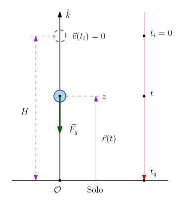

# Queda livre 

## Descrição Básica do Projeto
Este projeto é uma simulação criada para visualizar o conceito de gravidade e queda livre na Física. O propósito é oferecer uma representação gráfica que permita o estudo e a compreensão dos conceitos envolvidos. O código gera uma animação que representa a queda livre de uma maçã a partir de uma altura \( H \) conforme ocorre a passagem do tempo. 

Desta maneira, é possível avaliar como a queda se comporta variando parâmetros como, por exemplo, a altura inicial da queda e o valor da gravidade. A simulação permite uma análise visual e quantitativa, ajudando a aprofundar o entendimento dos efeitos da gravidade e das leis do movimento sobre um corpo em queda livre.

 ## Conceitos de Física e Modelo Matemático:

 **Queda Livre**
 
Quando soltamos um objeto de massa $m$ do repouso, a partir de uma altura $H$  acima do solo, ele fica sujeito à força gravitacional $\vec{F}_g$.

A queda livre é um movimento caracterizado pela ausência de forças resistivas, como a resistência do ar, deixando a gravidade como a única força atuante. Quando um objeto cai em queda livre, ele experimenta uma aceleração constante devido à gravidade, que na superfície da Terra tem uma média de $9,8 m/s^2$.

Neste tipo de movimento, a velocidade do objeto aumenta progressivamente à medida que ele se aproxima do solo. A queda livre é um exemplo clássico do movimento uniformemente acelerado, descrito por equações que permitem calcular a velocidade e a posição do objeto ao longo do tempo. Estudada por cientistas como Galileu Galilei, a queda livre ajuda a entender a influência da gravidade e serve de base para conceitos fundamentais da Física.

A **Figura 1** mostra uma representação de um objeto caindo em queda livre a partir de uma altura $H$, utilizando o sistema de referências escolhido, no qual o solo é formado pelo plano $xy$.

<p align="center">
  
  <br>
  <em>Figura 1: um objeto, sob ação da gravidade, solto do repouso de uma altura H. Retirado de (1).</em>
</p>


A força $\vec{F}_g$ que atua no objeto de massa  $m$ caindo da altura $H$ é a força gravitacional, que é dada pela equação:

$$\begin{equation}
\vec{F}_g = - m \cdot g  \hat{k}
\end{equation}$$

Definindo os vetores posição, velocidade e aceleração como: 

$$\begin{equation}
\vec{r}(t) =  z(t)\hat{k}
\end{equation}$$

$$\begin{equation}
\vec{v}(t) =  \dot{z} (t) \hat{k}
\end{equation}$$

$$\begin{equation}
\vec{a}(t) = \ddot{z} (t) \hat{k}
\end{equation}$$

Usando a força da fravidade na forma de coornadas temos que: 

$$\begin{equation}
-m \cdot g  \hat{k} = - m \cdot \ddot{z} \hat{k}  
\end{equation}$$

A equação acima implica que $g = \ddot{z}$. Resolvendo a EDO acima, encontramos a solução: 

$$\begin{equation}
z(t) = z_0 + v_0 t - \frac{1}{2} g t^2 
\end{equation}$$

E quando substituimos as condições iniciais da queda livre, ou seja $v_0 = 0$ e $z_0 = H$, encontramos: 

$$\begin{equation}
z(t) = H - \frac{1}{2} g t^2 
\end{equation}$$

 **Uma maçã caindo de um galho:**
 Imagine a cena: um físico distraído está andando tranquilamente sob uma árvore, pensando em teorias sobre o movimento dos corpos e as leis da física, quando, de repente, uma maçã cai de um galho e acerta sua cabeça. Isso, claro, nos faz lembrar da famosa história de Isaac Newton. 

 Agora, voltando ao nosso físico moderno, ele se pergunta: Qual seria o tempo que essa maçã levaria para cair do galho até sua cabeça? Como a trajetória da maçã poderia mudar se não estivéssemos no planeta Terra, o que implica em variar a gravidade do sistema. 

Para resolver isso, foi feita uma simulação de queda livre em Python, na qual os parâmetros de entrada podem ser variados. 

<p align="center">
  
  <br>
</p>


## Implementação

- **Linguagens e Pacotes:**  
  O projeto foi implementado em Python, utilizando os pacotes NumPy e Matplotlib. Cada um desses pacotes oferece ferramentas específicas para lidar com  visualização, computação científica, interações físicas, permitindo que a simulação seja interativa e visualmente intuitiva.

## Como Usar

- **Instalação e Dependências:**  
  - Certifique-se de que o Python 3.6+ (ou outra versão de linguagem) está instalado.
  - Instale os pacotes necessários executando:
    
    ```bash
    pip install -r requirements.txt

  - **Exemplos de Uso:**  
  - Para rodar a simulação básica, utilize o código:
    ```python
      python main.py
    ```
 - Certifique-se de fazer o dowload da imagem da maçã utilizada na animação e de fornecer o caminho correto para ela.

   **Configuração Inicial:** Parâmetros iniciais podem ser ajustados:
    -  Posição inicial do objeto em metros.
    - Velocidade inicial do objeto em $m/s$.
    -  Aceleração da gravidade em $m/s^2$.
    -  Tempo máximo de simulação em segundos.
    -  Número de pontos para a geração do vetor de tempo.

  - **Informações sobre o projeto:**
 
  Esste projeto foi desenvolvido por:
  
      Julia Marcolan Teixeira: juliamarcolan@usp.br  
    
  Como exemplo de como deve ser entregue o projeto final que faz parte  do processo avaliativo da disciplina 7600105 - Física Básica I (2024) da USP-São Carlos ministrada pelos professores Krissia de Zawadzki e Esmerindo de Sousa Bernardes.

 ## Referências: 
 (1) Bernardes, E. de S. (2024). Dinâmica-v2 (Notas de aula). 7600105 - Física Básica I. Universidade de São Paulo, São Carlos.
